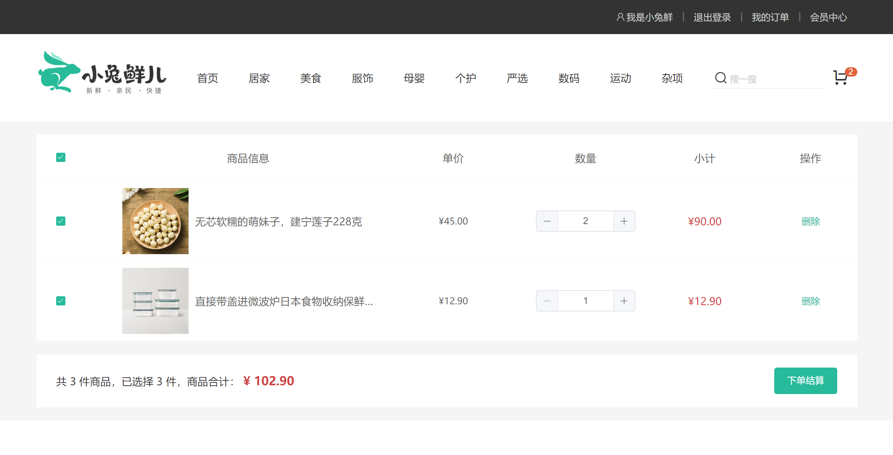
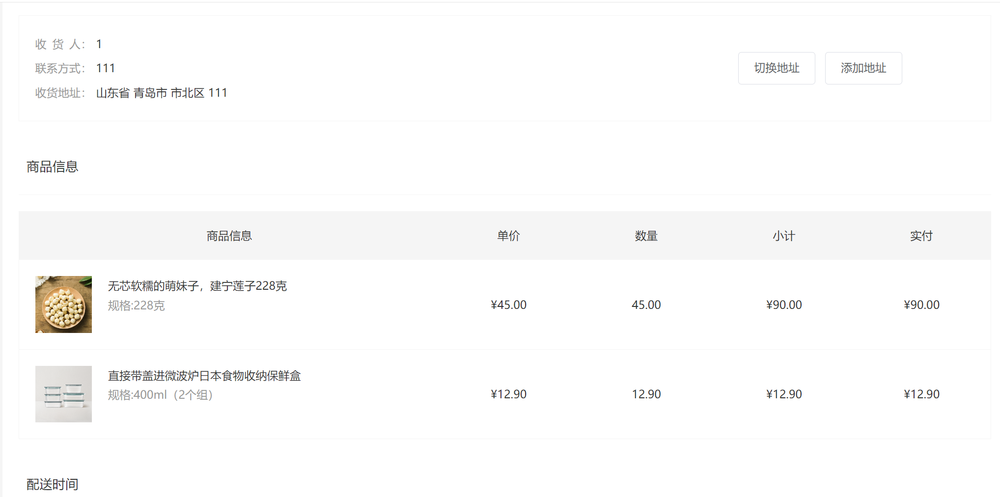
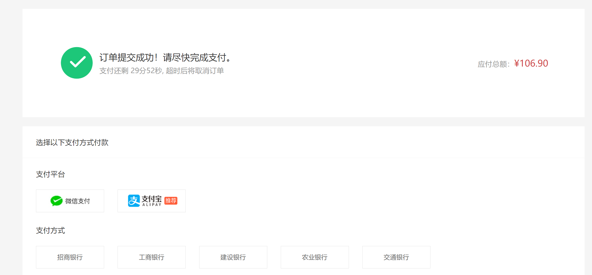

# 购物商城项目-Vue3

接口文档地址：https://apifox.com/apidoc/shared-c05cb8d7-e591-4d9c-aff8-11065a0ec1de/api-67132167

## 1.项目简介

本项目是基于vue3的一个前端购物商城项目

代码编写工具：**VSCode + Volar (and disable Vetur) + JavaScript + gitee + ESLint**

配置环境：详情看 [vite.config.js](https://gitee.com/xu-junxian/vue3_shopping/blob/master/vite.config.js)

安装包：详情看 [package.json](https://gitee.com/xu-junxian/vue3_shopping/blob/master/package.json)

### 1.1主要技术栈

- HTML、JavaScript、CSS、Axios
- 构建框架：Vue3
- 状态管理：pinia
- 构建工具：vite
- 组件库：element-plus
- 路由管理：vue-router

## 2.项目功能模块

| 页面       | 模块                       | 解决方案                                                     |
| :--------- | :------------------------- | :----------------------------------------------------------- |
| 首页       | 推荐模块、分类模块         | 首页搭建框架、图片懒加载、触底加载、商品展示组件封装、导航置顶、路由滚动配置、面包屑导航 |
| 商品详情页 | 规格选择模块               | SKU组件封装、面包屑导航、图片放大镜封装                      |
| 登录页     | 登录模块                   | 表单校验、持久化存储、获取token配置请求响应拦截器            |
| 购物车页   | 购物车模块                 | 弹窗购物车(首页架子中)、列表购物车、全选反选功能、登录与未登录购物车合并、持久化存储 |
| 订单页     | 地址模块、商品列表模块     | 地址切换、更新购物车、pinia应用                              |
| 支付页     | 支付模块                   | 倒计时组件封装(dayjs)、跳转支付地址                          |
| 用户页     | 个人信息模块、订单状态模块 | 猜你喜欢、地址管理、tab导航切换、订单分页控制、个人信息表单校验(增删改) |

## 3.项目图片展示

首页


首页一级分类


登录


商品详情


购物车



订单结算



支付



个人中心


## 4.项目安装

### 1.安装依赖

```sh
npm install
```

### 2.启动项目

```sh
npm run dev
```

### 3.打包项目

```sh
npm run build
```
